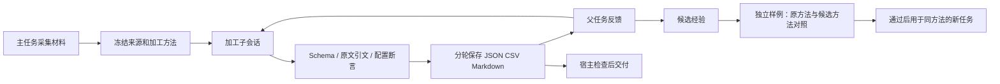

# 持续子会话与经验回放（0.8）

这次在已有采集、加工、任务恢复和上下文预算之上，补齐加工过程的持续状态、
交付核验和经过对照验证的经验复用。旧的 `browser_process` 和 workflow `process`
仍然支持一次加工；普通任务中的 `delegate_processing` 现在创建持久化子会话。
没有把浏览器循环整体替换成其他框架，也没有引入 DeepSeek Harness 的运行时依赖。



## 持续会话

每个 worker 保存原始记录、方法、Skill 文本、解析后的模型配置和方法哈希；
每轮再冻结反馈、前两轮草稿和当时采用的经验。原文始终从原始记录读取，草稿和经验
不作为事实来源。改变输入、方法、Skill 或模型需要创建新会话；恢复时发现变化会停止。
262K 的容量检测和 0.7 的统一预算继续适用于加工提示。

每次反馈创建 `turns/1`、`turns/2` 等独立目录。旧结果不会被新修订覆盖。
相同反馈已经成功应用时，重复提交返回原结果，不再次调用模型。
`expected_turn` 必须等于刚看到的轮次，避免旧请求重复应用；它不是目标轮次。
待完成的当前轮不能直接插入新反馈，需要继续当前轮或先取消。

CLI、MCP 和 Python 使用同一 SQLite 状态；重启调用进程后可恢复。
SQLite 中保存追加事件、父任务关系、轮次、租约及取消标志；每条记录另有输入和验证回执。
中断恢复会复用哈希和检查均通过的记录，失败记录保留尝试日志。正在等待模型响应时
也会检查取消。进程消失后的租约约 30 秒到期，可再次继续。

这是按轮执行的持久化 worker，调用方等待当前轮返回。它不是独立常驻服务、任意工具
执行器或无限递归子智能体。任务事件仍沿用原有保存方式，新增 worker 日志不代表
整个浏览器系统已经改成事件溯源架构。

## 调用

先使用已注册的 profile。示例材料是人工构造的发布栏目文本，URL 为来源标签，
演示命令不会抓取这些虚构页面。

```powershell
python -m cdp_browser_agent.browser --config examples/learning-30000.json --worker-start section-heading --processing-input examples/processing-inputs/heading.json
python -m cdp_browser_agent.browser --config examples/learning-30000.json --worker-continue <worker_session_id> --worker-turn 1 --worker-feedback "从 Releases 栏目提取第一条发布标题，保持原文。"
python -m cdp_browser_agent.browser --config examples/learning-30000.json --worker-status <worker_session_id>
```

`--worker-continue ID` 不带反馈表示继续中断轮次；已完成会话会直接返回现有结果。
`--worker-cancel ID` 取消当前轮。新的会话 ID 为 32 位十六进制字符串，不能传路径。

0.8 发布时 MCP 总计 21 个工具，该版本新增：

| 工具 | 用途 |
|---|---|
| `browser_worker_start(profile, records)` | 创建并执行首轮 |
| `browser_worker_continue(worker_session_id, feedback?, expected_turn?)` | 继续中断轮次或按反馈修订 |
| `browser_worker_status(worker_session_id?, after=0)` | 状态、分页事件；省略 ID 列出独立会话 |
| `browser_worker_cancel(worker_session_id)` | 取消并保留记录 |
| `browser_experience_list(profile?)` | 经验状态及已注册回放集 |
| `browser_experience_replay(experience_id, suite)` | 执行有成本上限的对照回放 |
| `browser_experience_revoke(experience_id)` | 撤销经验，保留历史 |

主智能体使用 `delegate_processing`、`processing_continue`、`processing_status` 和
`processing_cancel`；只能操作自己父任务下面的 worker。重启父任务后仍能发现子会话。
外部 MCP 是操作者接口，调用者可按已知 ID 管理会话，不提供多租户身份隔离。

## 可配置结果核验

加工 profile 的 `verification` 支持以下确定性检查；字段可用 `a.b.0` 访问嵌套值。

| kind | 参数 | 检查 |
|---|---|---|
| `equals_input` | output, input | 输出与原输入字段类型和值均相等 |
| `contained_in_input` | output, input | 非空输出字符串是指定输入字符串的连续片段 |
| `nonempty` | output | 非 null、非空字符串/数组/对象；数值 0 和布尔 false 仍是有效值 |
| `range` | output, min, max | 有限数值在闭区间内，布尔值不视为数值 |

检查失败的记录只进入 failures，保留模型候选和错误，不进入成功导出。
交付清单记录输出、方法和上下文哈希，主任务完成时重新读取导出、原输入和检查规则。
同一 worker 如果已有新轮次，旧结果不能再用来通过父任务检查。

```json
{
  "agent": {
    "completion_processing": [
      {"profile": "page-facts", "min_records": 1, "min_turn": 2, "require_contract": true}
    ]
  }
}
```

这个示例要求至少一条 page-facts 成功记录，并至少完成一次反馈修订。
不要求修订时把 min_turn 设为 1 或省略。没有配置完成检查时仍为 model_reported。
完成检查来自操作者配置，不能由模型自行放宽。`host_verified` 和 `contract_verified`
只证明配置的条件通过，例如标题一致、文件未变化；不证明摘要的全部语义正确。
`semantic_accuracy_verified` 继续为 false。

## 经验如何获得和使用

成功的后续反馈如果满足 profile 检查，会生成候选经验，记录反馈来源是外部调用者还是
父智能体、原会话、轮次和输入哈希。候选不会立即进入后续提示。

操作者通过 `processing.replay_paths` 注册含 2–10 条不同输入及 expected 输出的回放集。
参考 `examples/replays/release-headings.json`。输入必须与候选来源不同，比较按 data 哈希
进行，仅换 URL 或 record_key 不能伪装成独立输入。期望输出只交给宿主比较，不写进
模型提示；模型只能看到原方法、输入和候选反馈。

每条样例运行原方法和候选方法，方法、Skill、模型配置保持一致。两者都必须先通过
Schema、引文和配置断言，再与 expected 对象严格匹配。晋升要求：候选所有样例通过，
且至少一个原方法结果失败。相等表现和任何候选回退均不晋升。重放失败会取消既有
晋升；并发容量不足产生 deferred，不把未执行的测试当成能力下降。并发撤销优先。

```powershell
python -m cdp_browser_agent.browser --config examples/learning-30000.json --experience-replay <candidate_experience_id> --replay-suite release-headings
python -m cdp_browser_agent.browser --config examples/learning-30000.json --experience-list section-heading
python -m cdp_browser_agent.browser --config examples/learning-30000.json --experience-revoke <candidate_experience_id>
```

晋升后，使用完全相同方法哈希的新加工任务自动采用最多两条经验，30 天后过期。
撤销后新任务不再采用；已经执行的结果不被删除。中断轮次若冻结了已撤销的经验，
恢复会停止，需要取消该轮后再发反馈。
`processing.auto_replay=true` 会在成功反馈产生候选后自动选择第一个同 profile 回放集；
默认 false。自动回放失败不抹除已经完成的加工结果，响应保留回放错误。

这实现了“反馈修订 → 候选 → 对照验证 → 有范围的复用”，没有训练模型权重、
自动改写程序或 Skill，也没有证明在任意网站上成功率提高。回放集需要由操作者维护，
不能把两个示例的成功当成一般能力评测。

## 默认边界与存储

| processing 配置 | 默认 | 允许范围 |
|---|---:|---|
| worker_max_turns | 5 | 1–20 |
| worker_max_attempts | 3 | 每轮 1–10 次恢复/执行尝试；profile 另有限制修复调用次数 |
| max_children_per_task | 8 | 1–100 |
| max_concurrent_sessions | 1 | 1–4，持续会话和经验回放共用 |
| replay_timeout_seconds | 300 | 大于 0，不超过 3600 秒 |

这不是整个模型服务的全局队列：旧的一次加工接口、其他项目和独立主任务模型请求
仍由各自调用方管理。当前 30000 服务只有一个推理槽位，默认持续加工保持串行。
需要运行较长回放时，同时配置足够的 harness.tool_timeout_seconds 和 run_timeout_seconds。

状态位于 `processing.artifact_dir/workers/workers.sqlite3`，输入和轮次输出位于其 worker
子目录；经验库为 `processing.artifact_dir/learning.sqlite3`，回放位于 `replays/`。
路径均相对配置文件解析。更换 artifact_dir 会使用另一套状态。存储保留原始内容和
反馈，部署者应按自己业务要求管理保留时间和访问范围。

旧版本的日志、交付和源码快照保持原样。0.7 的一次加工结果不会被伪造成新的持续会话；
为新会话传入原始记录。改动验证规则也会改变方法哈希，需要新 worker。
