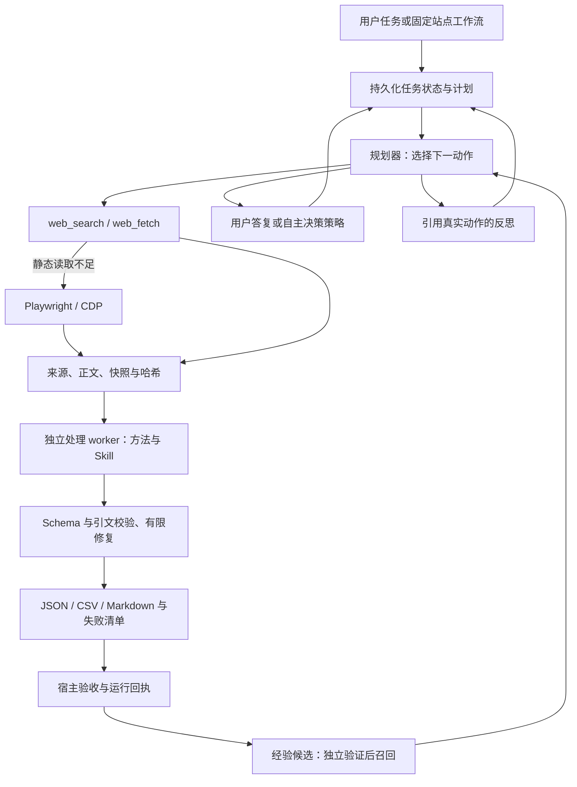

# 运行底座与上下文演进（2026-09-28）

## 判断

项目已有可用的浏览器执行器、工具注册、Skill/MCP 接口和确定性工作流。
应保留 Playwright/CDP 执行层，重构任务生命周期、证据交接和记忆管理，不需要为了名称换成
某个大型框架。0.6 在现有模块上加入持久化 Session 和处理 worker，降低迁移已有站点流程的成本。

“Harness” 在这里指模型循环外围负责状态、工具、权限、上下文、验证和恢复的运行系统。
模型负责选择动作；底座负责判断动作是否可执行、结果如何保存，以及任务是否真的通过验收。

## 官方资料对照

Anthropic 的长任务实践使用初始化、逐项推进、明确进度产物和验证来连接多个上下文窗口；
单纯压缩对话不足以保证任务完成。对于本项目，相应做法是保存任务状态与处理回执，恢复时
核对当前网页和未确定动作。[官方长任务实践](https://www.anthropic.com/engineering/effective-harnesses-for-long-running-agents)

Anthropic 的上下文实践强调按需载入、压缩、结构化笔记和分开的子任务上下文。
本项目对应 Skill 按需读取、有限近期历史与相关召回、保留计划/用户决定，以及仅给处理子智能体
当前记录与处理方法。[官方上下文工程说明](https://www.anthropic.com/engineering/effective-context-engineering-for-ai-agents)

Deep Agents 把计划、文件、子智能体和上下文管理集成为较完整的 agent harness。
我们的目标更窄：为浏览器取证与结构化数据交付提供可核验的流水线，暂不引入任意代码执行
和通用子智能体网络。[Deep Agents 概览](https://docs.langchain.com/oss/python/deepagents/overview)

LangGraph 的 interrupt 配合持久化检查点进行暂停和恢复；恢复点附近的副作用需要考虑重放。
本项目使用 SQLite 租约、pending_action 和宿主检查来处理这一问题，人工等待另外支持显式
的超时自主策略。[Interrupts](https://docs.langchain.com/oss/python/langgraph/interrupts)、
[Persistence](https://docs.langchain.com/oss/python/langgraph/persistence)

这些是工程机制的参考，不是对框架性能优劣的基准测试，也不等价于采用了这些框架的所有能力。

## 代码差异

| 维度 | 0.5 的实际情况 | 0.6 已实现 | 后续边界 |
|---|---|---|---|
| 普通任务 | 有运行日志，进程内动作循环 | SQLite 检查点、独占租约、恢复接口、pending_action | 无分布式任务队列/自动重启调度 |
| 任务计划 | 下一动作规划，缺少独立计划产物 | plan_update、持久化步骤状态 | 计划状态是模型自报，不能当验收 |
| 反思 | 可选策略评审，无统一证据关联 | reflect 必须引用当前真实 actionId，保存下一策略 | 不保存隐含推理过程，不自动改代码 |
| 信息加工 | 浏览器提取与最后回答在主上下文 | 独立记录处理、方法/Skill/Schema、校验修复、导出 | 串行 worker，无任意执行沙箱、跨记录聚合规划 |
| 人工介入 | ask_user 返回，任务结束 | auto、有限等待后自主、显式 return；真实答复接口 | 登录/验证码/未知效果仍可能使任务 incomplete |
| 短期记忆 | 近期历史、相关召回和摘要分块 | 快照恢复，计划/决定/反思保留，history_read 按需回查 | 召回是规则/相关度机制，未建立向量知识库 |
| 上下文预算 | 字符粗估，部分内容整块移除 | 中文估算更保守；按成功响应 usage 校准；历史逐项裁剪 | 未接入模型原生 tokenizer；视觉输入预算仍较粗 |
| 长期经验 | 可选站点经验，没有独立通过门槛 | 失败→恢复候选，至少两次独立宿主通过后召回；30 天有效期、撤销接口 | 不证明经验提高成功率，未自动更新 Skill/模型参数 |
| 浏览器状态 | 启动浏览器结束即关闭 | 动作后保存 cookies/localStorage/IndexedDB，重启载入 | 不恢复完整活页 JS/DOM，CDP 用现存会话 |
| 采集恢复 | 列表页级检查点 | 详情级缓存；失败 fetch 重试；处理项复用 | fetch 的跨运行条件请求和增量比较尚未实现 |
| 外部能力故障 | 某个 MCP 离线可能阻断整个任务 | 每个可选服务单独隔离，required=true 才阻断 | MCP 注解不是可授予权限的依据 |
| 观测 | 动作/结果日志 | 增加决策、处理回执、成功调用 token 与耗时 | 不是完整计费账本，失败请求不计入该 usage 汇总 |

原有网页自动代理仍属于 web_search/web_fetch。浏览器支持显式 `browser.proxy`
Playwright 配置，没有把 HTTP 工具的代理轮换自动复制到浏览器，也没有自动把登录 cookies
传给快速抓取。这些通道的行为在文档中分别说明。

## 运行结构

## 自主总结、自我改善的准确含义

本轮提供任务内策略调整与跨任务程序性记忆。`reflect` 记录简短结论、动作证据和下一策略；
它不以模型的自信程度代替验证。持久化经验只提取相邻失败→成功动作的类型与失败码，按站点
召回；不复制旧元素 ID、输入内容或账号。相同 run_id 不算第二次独立证据，至少两次
`completion_basis=host_verified` 且 verification.ok 的运行才会进入建议。

普通模型自行 done 默认仍是 model_reported，不能自动晋升经验。固定工作流的 agent 步骤或
Python 调用方的 completion_check 才能提供宿主验收。经验库在稳定的任务状态目录下共享，
工作流按次保存日志不会把经验切散。可用 `ExperienceStore.revoke(memory_id)` 撤销建议；
撤销后查询不再返回，原始证据仍保存。该接口目前是 Python API，没有管理界面。

这不是模型训练、自动修改自己的源代码或自动重写 Skill。把“改进”变成可靠能力还需要
记录候选策略，在固定任务集上比较有/无经验的任务完成、遗漏、来源正确性、调用数、token、
时延和人工介入次数，并在不同站点重新检验。未经过这样的实验，不报告成功率提升。

## 建议后续顺序

1. 建立冻结任务集：静态页、动态页、分页、会话失效、来源变化、格式失败；分别评估采集覆盖与加工语义。
2. 为经验候选增加检验集、版本和退化撤销，支持显式注册业务验收器，再考虑自动生成 Skill 补丁。
3. 增加文件引用式数据集访问、分块/归并、模型原生 tokenizer，避免大文本重新进入主上下文。
4. 对大量定时采集增加独立调度队列、并发预算、条件请求和存储保留策略；不要把一个无限循环当调度系统。
5. 有外部代码处理需求时，再引入真正的受限执行环境；当前处理器适合提取、归类、摘要及字段规范化。

具体配置与命令见 [处理与自主策略指南](PROCESSING_AUTONOMY.md)，已执行的证据见
[0.6 验收](HARNESS_VALIDATION.md)。
