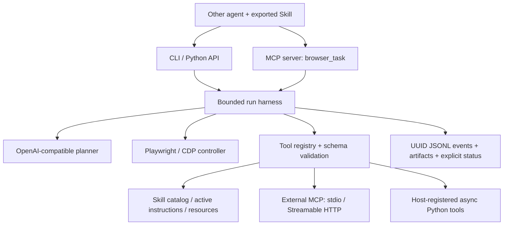

# 0.2 通用化与 Harness 更新

> 本文记录 0.2 通用化阶段。后续 0.3 原生执行、iframe、生命周期和真实模型验收见 [30000 实测审查](LIVE_TEST_30000.md)。

基线：`HGF-XNDX/CDP-Browser-Agent`，提交 `c52aa3a77f090ae0c416d37734fd04ee6cc04d86`。
日期：2026-09-27。本文保留 0.2 阶段记录；后续固定网站工作流与 0.4 验收见 [工作流验收](WORKFLOW_VALIDATION.md)。

## 审查结论与本轮处理

| 原问题 | 修改后的行为 |
|---|---|
| 特定行业文本解析、专门网站 API 和采集规则混入通用运行层 | 删除专用解析及证据采集模块；主循环和策略校验改为通用实现；清除下载站点特判 |
| 保存一个文件就提前结束 | 记录已完成动作，继续处理完整任务 |
| 旧 FastMCP 接口与无上限 MCP 依赖组合，新安装会拉入不兼容主版本 | 迁移 MCP SDK 2.2 接口，声明 `mcp>=2.2,<3` |
| 只有对外 MCP，无内部工具扩展 | 增加工具注册、JSON Schema 校验、MCP 客户端和显式工具白名单 |
| 无 Skill 发现和加载 | 增加 frontmatter 解析、元数据目录、按需加载、资源读取、预算与目录边界 |
| MCP 调用可传本地配置路径；扩展后将可间接启动任意配置中的程序 | 连接、目录、命令、密钥由启动配置固定，MCP 仅接受任务与降低步骤限制 |
| 旧 ask_user 持续轮询；keep_open 会等待终端输入 | 立即返回 needs_input；移除阻塞终端交互 |
| 无进展只看 URL、来源/资源数量 | 纳入页面文本、表单状态与工具结果，识别同页变化和重复循环 |
| 到达上限仍可能总结资料并记作成功工作流 | 显式 max_steps/stalled/failed；只有规划器 done 才报告 completed，并标注 model_reported |
| 日志路径在安装目录，秒级文件名会碰撞 | 使用用户工作目录或配置路径，UUID 日志、动作前后事件、终止事件 |
| stdout 进度污染工具调用，进程级 redirect_stdout 有并发风险 | logging 写 stderr；移除全局 stdout 重定向 |
| 短于 80 字的结果页面保存失败 | 通用保存只拒绝空文本 |
| 文件重名覆盖历史下载；Windows 设备文件名不稳定 | 同名添加唯一后缀，文件名清理和设备名处理 |
| 按键用 synthetic DOM event，不能可靠触发真实键盘行为 | 使用 Playwright keyboard.press |
| 浏览器启动失败可能漏清理 | 启动异常和任务结束统一释放本次资源 |

## 架构

保留 OpenAI-compatible JSON 单步规划协议，使已有本地模型仍能使用；不要求模型支持原生 function calling。
扩展动作采用 `{"action":"tool","name":"...","arguments":{...}}`。
工具失败进入下一轮观察，取消继续传播；执行工具超时不会自动重试。
内部所有浏览器动作仍使用确定性校验；外部工具另用各自的 JSON Schema 和配置白名单。

Skill 负责流程知识，MCP/Python Tool 负责执行能力，浏览器控制器负责页面操作。
二者并列接入，Skill 不会修改工具白名单，也不能在发现时执行脚本。
规划请求最后有总体字符预算保护：优先去除重复历史，再压缩页面文本；必要的任务、Skill 和工具
信息超过预算时明确失败，不静默截断指令。字符估算不是特定模型的精确 tokenizer。

## 兼容变化

- CLI、Python `run_browser_agent` 和 CDP 连接方式保留。
- MCP `browser_task` 不再接收旧版 `config_path`、`base_url`、`api_key` 等覆盖参数；迁移到服务启动 `--config`。
- 内部旧行业辅助模块和大量站点/数据集启发式策略不再提供；这是通用化的有意变更。
- 默认关闭跨任务站点记忆、二次评审和模型摘要，减少隐藏模型调用；需要时仍可配置开启。
- 默认起始页改为空白。`keep_open_after_run` 和 `manual_poll_ms` 不再控制阻塞操作。
- 所有结果要检查 `status`；有 answer 文本不等于任务完成。
- Skill 脚本、OAuth 自动交互、MCP resources/prompts 代理不包含在当前扩展范围；当前接入的是 tools。

## 已验证范围与后续边界

测试覆盖：Skill 渐进加载与越界阻止、工具参数/超时/截断、异步 Python 扩展、真实外部 stdio MCP、
真实 Streamable HTTP MCP、对外 stdio 服务、参数配置隔离、运行状态和取消清理。
真实 Chromium 端到端走通：Skill 加载 → 参考资料 → 外部工具 → 输入 → Enter → 观察变化 → 页面保存 → 完成。
端到端模型响应来自本地协议桩，因此这里只证明接口、生命周期和浏览器执行路径，不证明模型能力。

当前日志可审计，不提供跨进程恢复。needs_input 不保留可恢复的 launch 会话；CDP 保留用户浏览器。
同一 MCP 实例串行化；多个进程共用 CDP/站点记忆仍需宿主协调。
默认浏览器可访问本机网络，外部 stdio 服务以当前用户身份执行；本包不提供 OS 沙箱或多租户隔离。
自然网站任务成功率、长任务恢复、复杂 iframe/Canvas/上传以及独立完成验证仍需后续专项实现和评测。

## 本轮采用的官方资料

- [Anthropic: Scaling Managed Agents](https://www.anthropic.com/engineering/managed-agents)：参考 session、harness、执行环境的接口分离。当前实现保留本地 JSONL，不声称已实现其托管架构。
- [Agent Skills specification](https://agentskills.io/specification)：采用 SKILL.md 元数据、正文、资源按需披露。
- [MCP Python SDK](https://github.com/modelcontextprotocol/python-sdk) 与 [v2 migration guide](https://py.sdk.modelcontextprotocol.io/migration/)：迁移 MCPServer / Client、snake_case 字段和 HTTP 传输。

这里的设计是针对这个仓库做的工程取舍，不是对某一整套商业 harness 的复刻。
